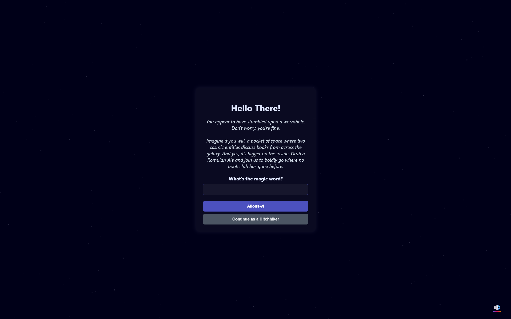
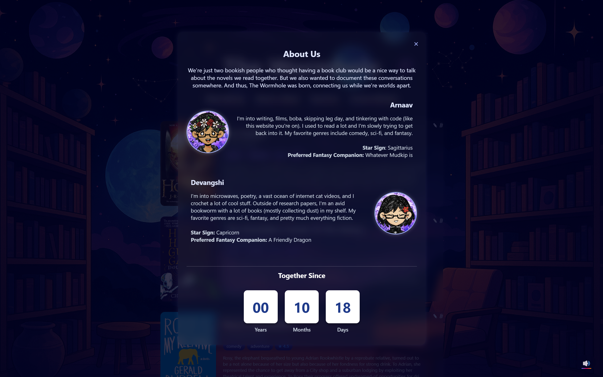

# Virtual Book Club

**The Wormhole** is an interactive, space-themed online book club platform designed for two main users with special privileges, and “hitchhiker” guests who can browse and engage in limited ways. It blends a thematic sci-fi aesthetic with dynamic Firestore integration for real-time updates, interactive book discussions, and guest reviews. This project was made as a present for my significant other.

You can visit the website [here](https://bookworm-1c325.web.app/). Note that guests such as yourself must "Continue as a hitchhiker" instead.

---

## Concept and Overview

The full-stack platform creates a cozy, fictional “wormhole” space where book lovers can discuss novels, ask and answer discussion questions, and rate books. The site’s interface and copy lean heavily into sci-fi and pop-culture references, giving it an immersive feel that goes beyond a typical reading log or forum.  

The entire app is powered by Firebase Hosting and Firestore, with data being live-fetched and updated in real-time. Authentication is passphrase-based, distinguishing between admin roles and guest roles without traditional login systems.

---

## Core Features

### 1. Landing and Authentication
- A **themed landing modal** greets visitors, locking the page until they:
  - Enter the secret passphrase (becoming either *Arnaav* or *Devangshi*, depending on input).
  - Or continue as a “Hitchhiker” for view-only access.
- Background effects include an animated starfield pre-auth and a static cosmic background post-auth.
- Background music toggle allows for an ambient audio experience.

---

### 2. Book Shelving and Display
- Authenticated admins can **“Shelve a Book”** via a modal form:
  - Inputs for title, author, genres, cover image URL, short description, and a list of discussion questions.
  - Auto-captures the **shelving date**, which is displayed on each card as “Shelved on: [date]”.
- Books appear in a card view, sorted **by most recent shelving date**.
- Each card displays:
  - Cover image.
  - Title and author.
  - Short description.
  - Date shelved.
  - Clickable area to open the book modal.

---

### 3. Book Modal View
- Opens with:
  - Title and author.
  - Side-by-side layout of the cover image and book description.
- **Ratings System**:
  - Admins have blue and purple stars respectively for ratings.
  - Ratings are 0–5 in half-star increments.
  - Only the respective admin can change their own rating.
  - Ratings update live in Firestore without page reloads.
- **Discussion Questions Navigation**:
  - Displays one question at a time.
  - Below the question is a centered navigation bar
  - Answers are displayed below, editable only by the admin who owns them.

---

### 4. Comments and Communication
- **Comms Module** button opens one of two modals:
  - Hitchhikers: *Initiate Comms* form → submit name and comment.
  - Admins: *Intercepted Comms* → see all comments in a scrollable list.
- Admins can **delete comments** from within the intercepted view using a small red delete icon in the top-right corner of each comment block.
- Comments are stored in a separate Firestore collection.

---

### 6. About Us Section
- Modal with personal bios of the two users.
- Includes a “Together Since” timer showing years, months, and days.

---

## Technical Implementation

- **Frontend**:
  - HTML, CSS (custom sci-fi gradient buttons `.bn40`), and vanilla JavaScript (`app.js`).
  - CSS animations for button hover “jump” effect and gradient underlines.
  - Scrollbars hidden where thematically necessary while still allowing scroll.
- **Backend**:
  - Firebase Firestore for persistent storage of books, comments, ratings.
  - Firebase Hosting for deployment.
  - Firebase Cloud Functions with Nodemailer to send email notifications to two recipients when a new book is shelved.

---

## Data Structure (Firestore)

- **Books Collection**:
  - Fields: `title`, `author`, `genres`, `imageURL`, `shortDescription`, `questions[]`, `answers{}`, `ratings{}`, `shelvedOn`.
- **Comments Collection**:
  - Fields: `name`, `comment`, `timestamp`.

---

## Hosting and Deployment

- Hosted on Firebase Hosting under a custom domain.
- Firestore rules currently allow all read/write access for simplicity.
- Changes to JS/CSS are redeployed via:
  ```bash
  firebase deploy --only hosting

## Screenshots






